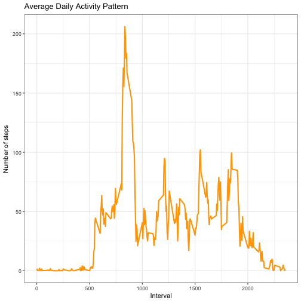
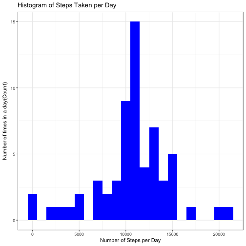
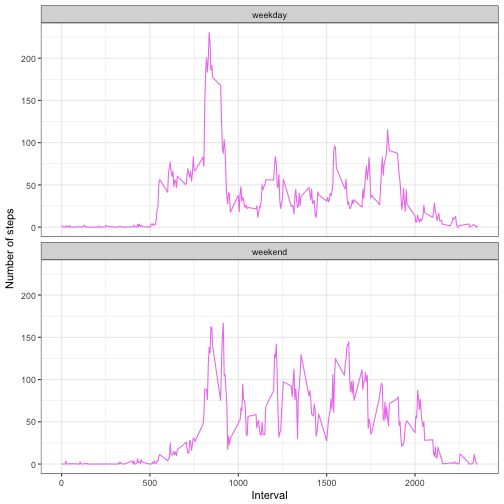

## Introduction
This document presents the results of peer assessments 1 of course Reproducible Research on coursera. This assignment makes use of data from a personal activity monitoring device. This device collects data at 5 minute intervals through out the day. The data consists of two months of data from an anonymous individual collected during the months of October and November, 2012 and include the number of steps taken in 5 minute intervals each day.  

### Prepare the R environment

```r
library(knitr)
opts_chunk$set(echo = TRUE, results = 'hold')
```
#### Load required libraries

```r
library(ggplot2)
```

## Loading and Preprocessing the data

```r
data<- read.csv('activity.csv', header = TRUE, sep = ",",
                  colClasses=c("numeric", "character", "numeric"))
data$date<- as.Date(data$date, format = "%Y-%m-%d")
data$interval <- as.factor(data$interval)
```

## What is mean total number of steps taken per day?
#### 1. Calculating total steps per day

```r
stepsPerDay <- aggregate(steps~date, data, sum)
colnames(stepsPerDay) <- c("date", "steps")
head(stepsPerDay)
```

```
##         date steps
## 1 2012-10-02   126
## 2 2012-10-03 11352
## 3 2012-10-04 12116
## 4 2012-10-05 13294
## 5 2012-10-06 15420
## 6 2012-10-07 11015
```
#### 2. Histogram for total number of steps taken each day

```r
ggplot(stepsPerDay, aes(x = steps)) + 
       geom_histogram(fill = "green", binwidth = 1000) + 
        labs(title="Histogram of Steps Taken per Day", 
             x = "Number of Steps per Day", y = "Number of times in a day(Count)") + theme_bw() 
```


  
#### 3. Mean and median of the total number of steps taken per day

```r
stepsMean <- mean(stepsPerDay$steps, na.rm = TRUE)
stepsMedian <- median(stepsPerDay$steps, na.rm = TRUE)
```
The mean is 10766.189  and median is 10765 

## What is the average daily activity pattern?

```r
stepsPerInterval <- aggregate(data$steps, 
                                by = list(interval = data$interval),
                                FUN=mean, na.rm=TRUE)

#convert to integers
##this helps in plotting
stepsPerInterval$interval <- 
        as.integer(levels(stepsPerInterval$interval)[stepsPerInterval$interval])
colnames(stepsPerInterval) <- c("interval", "steps")
```

#### 1. Time Series Plot of the 5 minute interval and avg number of steps taken

```r
ggplot(stepsPerInterval, aes(x=interval, y=steps)) +   
        geom_line(color="orange", size=1) +  
        labs(title="Average Daily Activity Pattern", x="Interval", y="Number of steps") +  
        theme_bw()
```


  
#### 2. Which 5-minute interval, on average across all the days in the dataset, contains the maximum number of steps?

```r
maxInterval <- stepsPerInterval[which.max(stepsPerInterval$steps),]
```
The 835 interval has maximum 206 steps.  

## Imputing missing values

#### 1. Total number of missing values

```r
missingVals <- sum(is.na(data$steps))
```
The total number of missing values are 2304

#### 2. Strategy for filling in the missing values
To populate missing values, we choose to replace them with the mean value at the same interval across days. 

We create a function na_fill(d, p) in which the 'd' argument is the 'data' data frame and 'p' arguement is the stepsPerInterval data frame.


```r
na_fill <- function(d, p) {
        na_index <- which(is.na(d$steps))
        na_replace <- unlist(lapply(na_index, FUN=function(idx){
                interval = d[idx,]$interval
                p[p$interval == interval,]$steps
        }))
        fill_steps <- d$steps
        fill_steps[na_index] <- na_replace
        fill_steps
}
```

#### 3. Creating a new dataset that is equal to the original dataset but with the missing data filled in


```r
data_fill <- data.frame(  
        steps = na_fill(data, stepsPerInterval),  
        date = data$date,  
        interval = data$interval)
str(data_fill)
sum(is.na(data_fill$steps))
```

```
## 'data.frame':	17568 obs. of  3 variables:
##  $ steps   : num  1.717 0.3396 0.1321 0.1509 0.0755 ...
##  $ date    : Date, format: "2012-10-01" "2012-10-01" ...
##  $ interval: Factor w/ 288 levels "0","5","10","15",..: 1 2 3 4 5 6 7 8 9 10 ...
## [1] 0
```
The out put shows that there are no missing values in the new data set.  

#### 4. Histogram for total number of steps taken each day

```r
fillStepsPerDay <- aggregate(steps ~ date, data_fill, sum)
colnames(fillStepsPerDay) <- c("date","steps")

##plotting the histogram
ggplot(fillStepsPerDay, aes(x = steps)) + 
       geom_histogram(fill = "blue", binwidth = 1000) + 
        labs(title="Histogram of Steps Taken per Day", 
             x = "Number of Steps per Day", y = "Number of times in a day(Count)") + theme_bw() 
```



##### Mean and Median after filling in missing values

```r
stepsMeanFill <- mean(fillStepsPerDay$steps, na.rm = TRUE)
stepsMedianFill <- median(fillStepsPerDay$steps, na.rm = TRUE)
```

The new mean obtained after filling in the missing values is 10766.189   
The new median obtained after filling in the missing values is 10766.189   

#### Does the values differ from the estimates obtained from the first part of the assignment
Old Estimates: Mean is 10766.189 and the Median is 10765  
New Estimates: Mean is 10766.189 and the Median is 10766.189  

We observe that the means are the same but the medians differ slightly.

## Are there differences in the activity patterns between weekdays and weekends?
We do this comparison with the table with filled-in missing values.  

1. Augment the table with a column that indicates the day of the week  
2. Subset the table into two parts - weekends (Saturday and Sunday) and weekdays (Monday through Friday).  
3. Tabulate the average steps per interval for each data set.  
4. Plot the two data sets side by side for comparison.  


```r
weekdays_steps <- function(d) {
    weekdays_steps <- aggregate(d$steps, by=list(interval = d$interval),
                          FUN=mean, na.rm=T)
    # convert to integers for plotting
    weekdays_steps$interval <- 
            as.integer(levels(weekdays_steps$interval)[weekdays_steps$interval])
    colnames(weekdays_steps) <- c("interval", "steps")
    weekdays_steps
}

data_by_weekdays <- function(d) {
    d$weekday <- 
            as.factor(weekdays(d$date)) # weekdays
    weekend_data <- subset(d, weekday %in% c("Saturday","Sunday"))
    weekday_data <- subset(d, !weekday %in% c("Saturday","Sunday"))
    
    weekend_steps <- weekdays_steps(weekend_data)
    weekday_steps <- weekdays_steps(weekday_data)
    
    weekend_steps$dayofweek <- rep("weekend", nrow(weekend_steps))
    weekday_steps$dayofweek <- rep("weekday", nrow(weekday_steps))
    
    data_by_weekdays <- rbind(weekend_steps, weekday_steps)
    data_by_weekdays$dayofweek <- as.factor(data_by_weekdays$dayofweek)
    data_by_weekdays
}
data_weekdays <- data_by_weekdays(data_fill)
```


```r
ggplot(data_weekdays, aes(x=interval, y=steps)) + 
        geom_line(color="violet") + 
        facet_wrap(~ dayofweek, nrow=2, ncol=1) +
        labs(x="Interval", y="Number of steps") +
        theme_bw()
```


  
By observing the graph above the activity on the weekday's has the greatest peak from all steps intervals. But, we can also observe that weekends activities has more peaks over a hundred than weekdays. 
